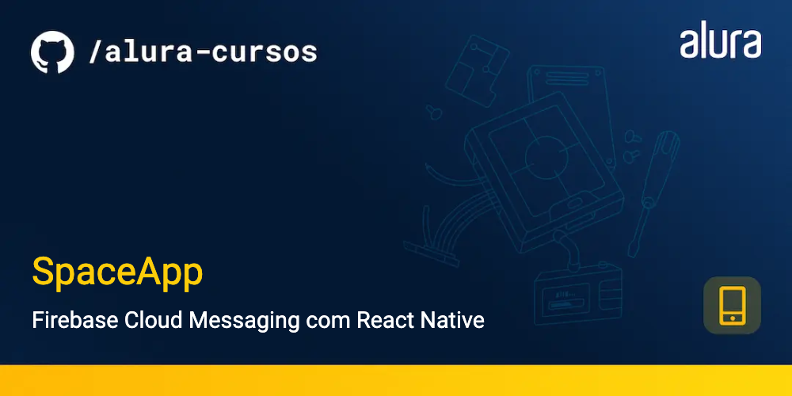

<h1 align="center">
    
</h1>
<h4 align="center"> 
	SpaceApp
</h4>

<p align="center">
  <a href="#information_source-o-que-é-o-spaceapp">O que é o SpaceApp?</a>&nbsp;&nbsp;&nbsp;|&nbsp;&nbsp;&nbsp;
  <a href="#rocket-Tecnologias">Tecnologias</a>&nbsp;&nbsp;&nbsp;|&nbsp;&nbsp;&nbsp;
  <a href="#information_source-como-usar">Como usar</a>&nbsp;&nbsp;&nbsp;|&nbsp;&nbsp;&nbsp;
</p>

## :information_source: O que é o SpaceApp?

O SpaceApp é uma aplicação feita em React Native que permite aos usuários entusiastas sobre astronomia salvarem fotos e informações sobre o espaço. Nessa aplicação foi integrado o Firebase Cloud Messaging para que os usuários possam receber notificações sobre novos conteúdos relacionados ao espaço.

Esse projeto é utilizado no curso de Firebase Cloud Messaging da plataforma da Alura.

<h1 align="center">
    
</h1>

## :rocket: Tecnologias

Esse projeto foi desenvolvido com a utilização das seguintes tecnologias:
- [React Native][rn]
- [Expo][expo]


## :information_source: Como usar

Para copiar e executar essa aplicação, você precisa de três pré-requisitos: Git, [Node.js][nodejs] + [Yarn][yarn] intalados no seu computador.

No terminal, digite os comandos a seguir:

### Baixar e instalar o projeto

```bash
# Clonar esse repositório
$ git clone https://github.com/alura-cursos/react-native-firebase-notification.git

# Vá para o ropositório
$ cd react-native-firebase-notification

# Instale as dependências
$ npm install
```


### Executar o Mobile

```bash
# Execute em outro terminal (dentro da pasta SpaceApp)
$ npx expo start
```

Para o projeto Web utilizado no curso, acesse o repositório [aqui](https://github.com/alura-cursos/spaceapp-web).


Espero que você utilize ao máximo deste projeto para se aprimorar! E se quiser dar um salve, estou lá no LinkedIn [André Oliveira Cunha](https://www.linkedin.com/in/andr%C3%A9-oliveira-cunha-b26b3a156/). :wave: 

[nodejs]: https://nodejs.org/
[expo]: https://docs.expo.dev/
[rn]: https://facebook.github.io/react-native/
[yarn]: https://yarnpkg.com/